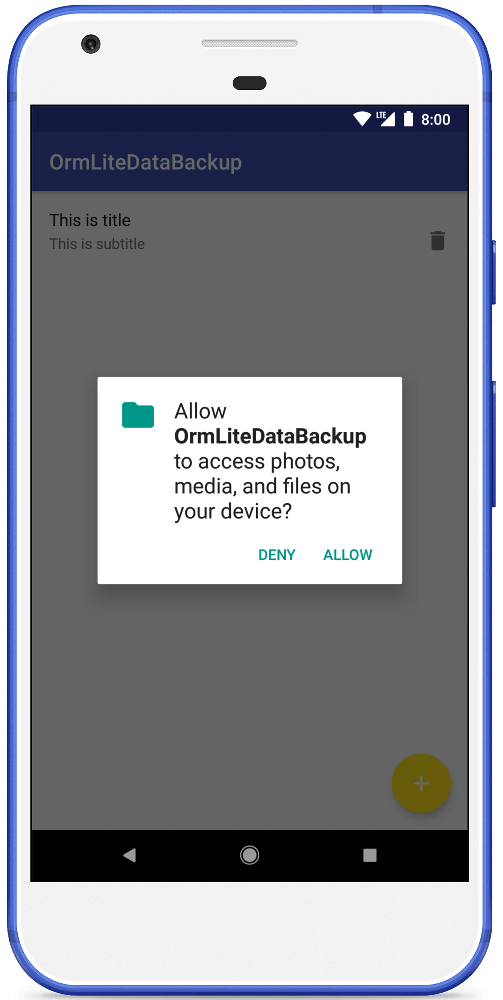
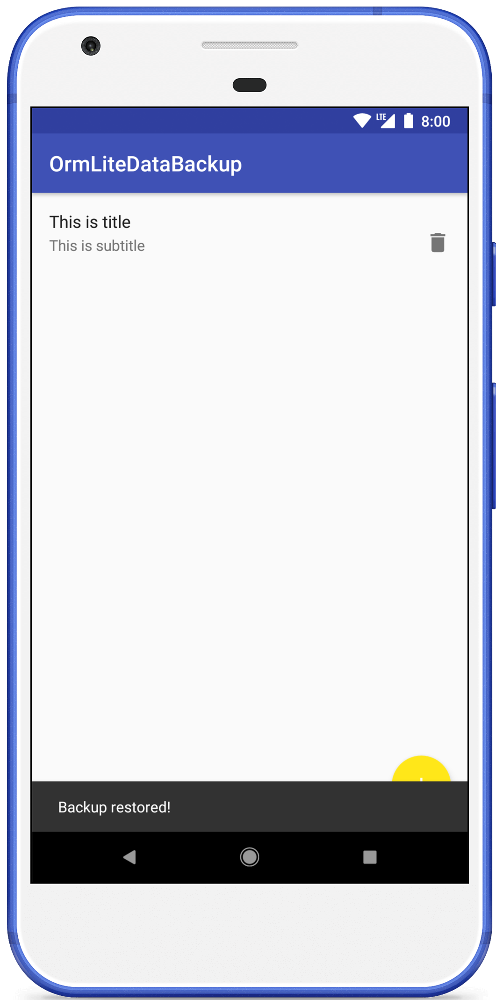

# ormlite-data-backup

Demo app for demonstration a way of backup user data.

## 1. Features

- create local (on running device) backup;
- restore local backup.

## 2. Screenshots

  
  
  
  
  

## 3. About

Main functionality is working. May contains some UI bugs.
