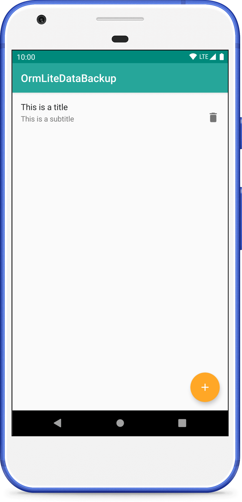
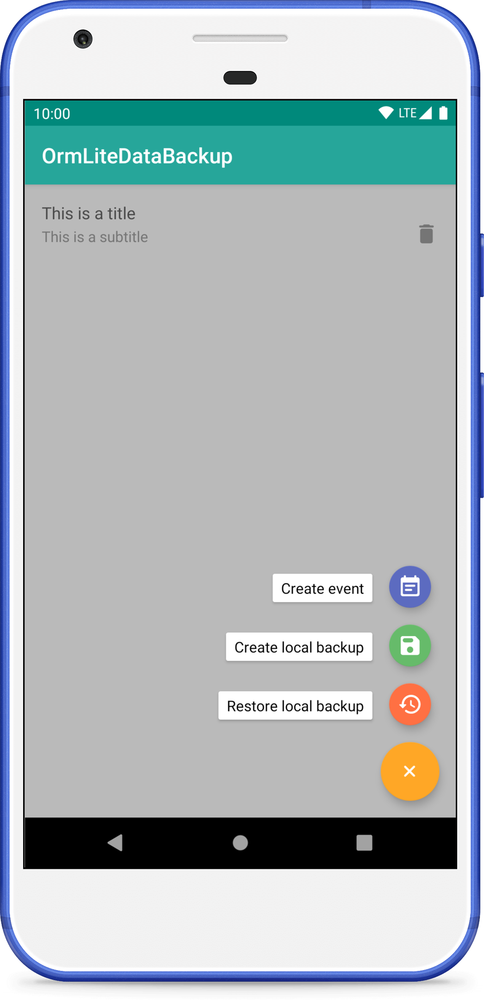
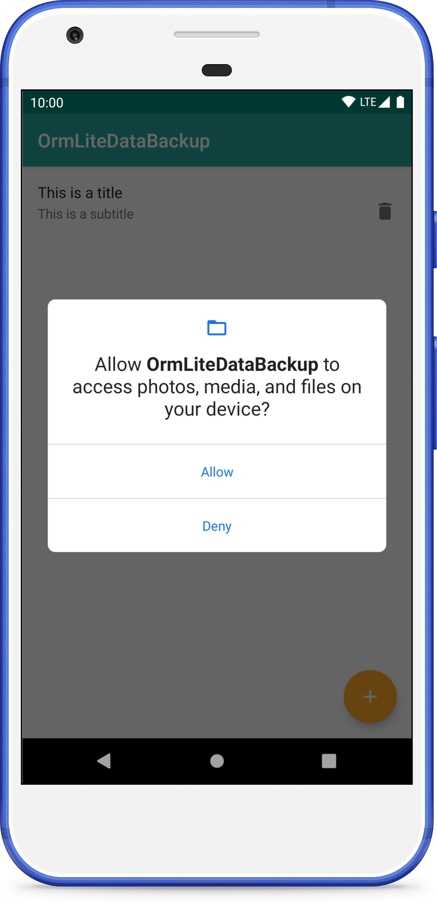
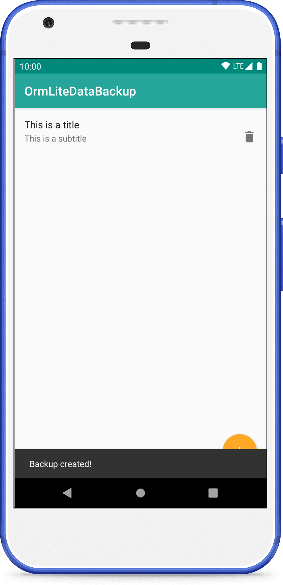

OrmLite Data Backup
=======================

About
-------------------

Demo app for demonstration a way of backup user data.
Main functionality is working.

Features
-------------------

* create local (on running device) backup;
* restore local backup.

Downloads
-------------------

Screenshots
-------------------

  
  
  
  
  

Contributors
-------------------

* [@fartem](https://github.com/fartem) as Artem Fomchenkov