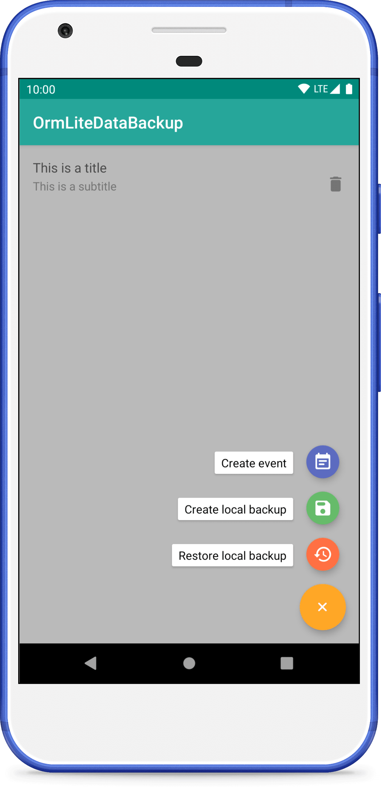

OrmLite Data Backup
=============

[](https://travis-ci.org/fartem/ormlite-data-backup)
[](https://codecov.io/gh/fartem/ormlite-data-backup)
[](https://android-arsenal.com/details/3/7940)
[](https://github.com/fartem/ormlite-data-backup/issues)

About
-------------

Demo app for demonstration a way of backup user data.
Main functionality is working.

Features
-------------

* create local (on running device) backup;
* restore local backup.

Downloads
-------------


Screenshots
-------------

<p align="center">
  
  
  
  
  
</p>

How to contribute
-------------

Read [Commit Convention](https://github.com/fartem/repository-rules/blob/master/commit-convention/COMMIT_CONVENTION.md). Make sure your build is green before you contribute your pull request. Then:

```shell
gradlew clean
gradlew build
gradlew -Pandroid.testInstrumentationRunnerArguments.class=com.smlnskgmail.jaman.ormlitedatabackup.AndroidTestSuite connectedCheck
```

If you don't see any error messages, submit your pull request.

Contributors
-------------

* [@fartem](https://github.com/fartem) as Artem Fomchenkov